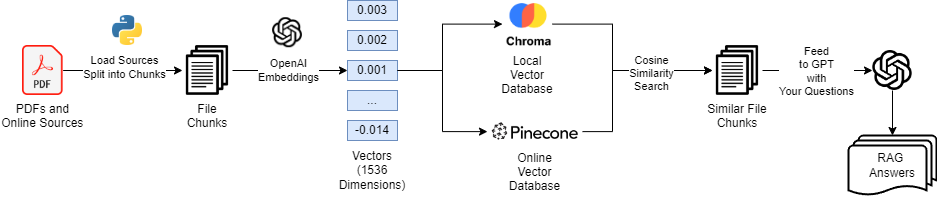

# Ask A Book Questions 📚

This repository provides a Colab-ready notebook to process and query PDF documents with the help of Large Language Models (LLMs).  
It also includes optional integration with [Pinecone](https://www.pinecone.io/) for vector storage.

If you're interested in industry level RAG system, please take a look at [Datawhale - All in RAG](https://github.com/datawhalechina/all-in-rag/blob/main/README_en.md) project for more interesting practice. 

---

## 🚀 Features
- Upload and process **PDFs** from a local directory
- Embed text into vectors for semantic search
- Ask natural language questions about your documents
- Optional: store vectors in **Pinecone**
- Works seamlessly in **Google Colab**

---

## 📂 Project Structure
```
.
├─ Ask_A_Book_Questions.ipynb
├─ pdfs.zip/
│  └─ pdfs/             # ← upload your PDFs here
├─ rag.png           # ← referenced figure
├─ .env                 # ← API keys file (not committed)
└─ README.md
```

---

## 📖 Example Workflow

1. **Clone this repo** or open the notebook in Colab.
2. **Upload PDFs** into the your Colab directory:
3. **Prepare a `.env` file** in the project root:
   ```dotenv
   # Required
   OPENAI_API_KEY=your_openai_api_key_here

   # Optional (only if using Pinecone)
   PINECONE_API_KEY=your_pinecone_api_key_here
   ```

---

## ⚙️ Setup in Colab

Directly upload this ipynb into Colab, and upload your .env and pdf in your workspace

## ⚙️ Obtaining API keys

- 🔑 Get your OpenAI API key from [https://platform.openai.com/account/api-keys](https://platform.openai.com/account/api-keys)  
- 🌲 Get your Pinecone API key from [https://app.pinecone.io](https://app.pinecone.io)  

## 📊 RAG Workflow Overview

Here’s the Retrieval-Augmented Generation (RAG) flow:



---

## 🔑 Notes
- Keep `.env` **private**. Never commit it to GitHub. **ANY UPLOAD WILL CAUSE SEVERE DAMAGE TO YOUR ASSETS!!!**
- **PDFs are for Study Purpose ONLY! Copyright reserved for Book Authors!**
- If not using Pinecone, you only need `OPENAI_API_KEY`.
- Works best with Colab + Google Drive.

---

## 📜 License
This project is licensed under the [MIT License](LICENSE).
